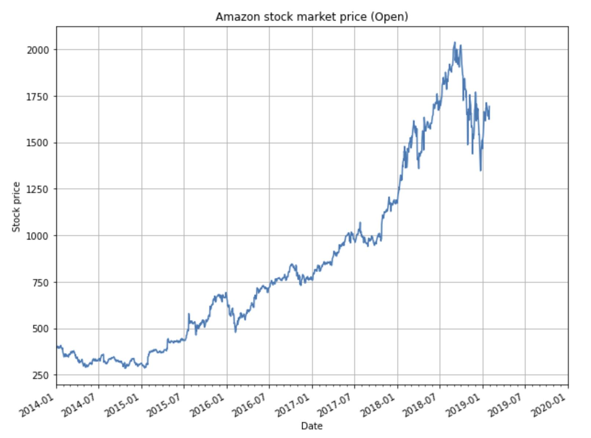
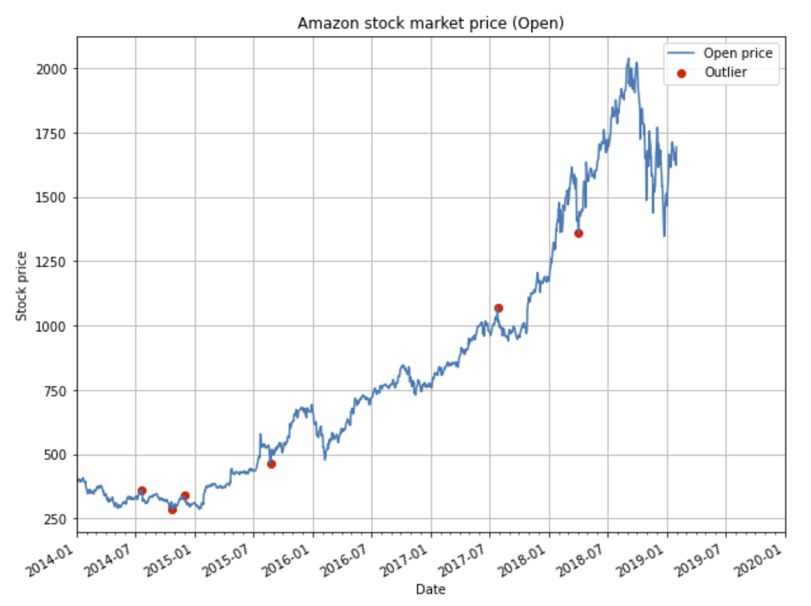
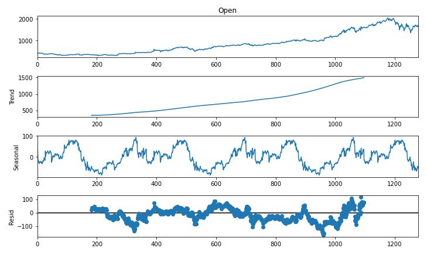
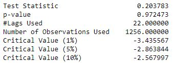
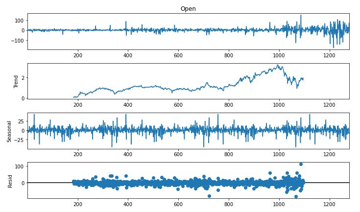
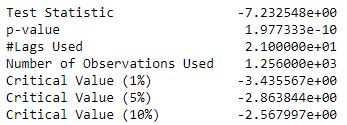
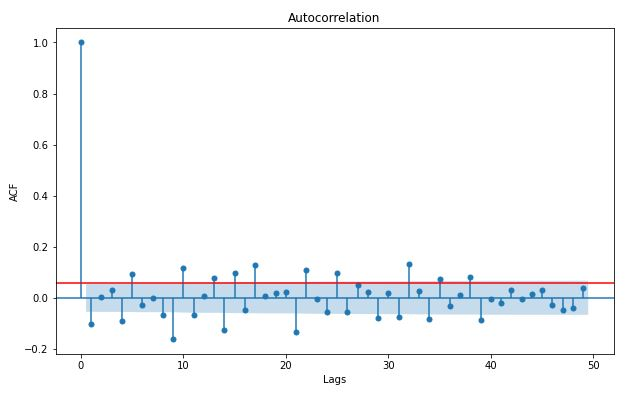
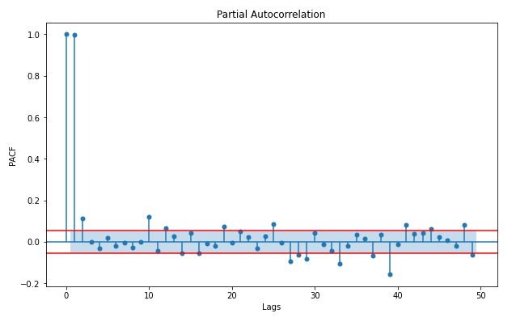
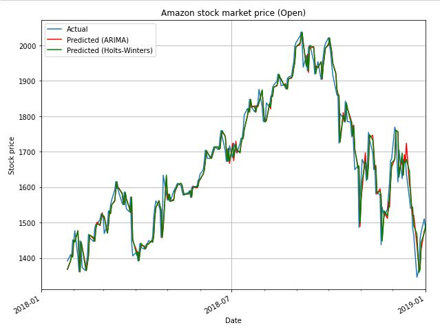
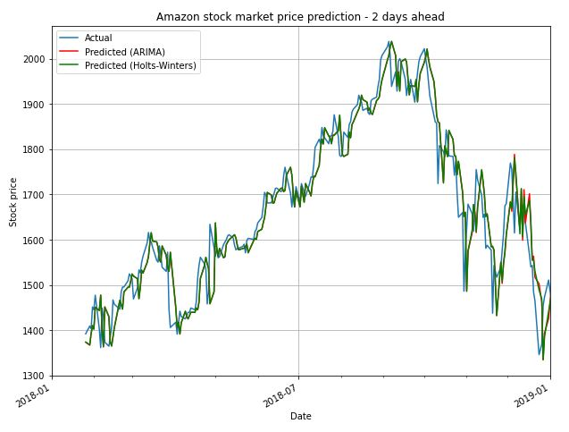

# Stock market price forecasting

**Authors**: Ana Jevtic and Stefanos Baros (both authors contributed equally)

## Dataset

The Amazon stock market data used in this project can be found at: https://www.kaggle.com/prasoonkottarathil/amazon-stock-price-20142019

The dataset contains 5 years (2/1/14 - 1/31/2019)  of daily prices: `Open`, `High`, `Low`, `Close` and `Adj Close`, as well as `Volume`. In this project we focus on forecasting `Open` prices (depicted below) using time series models.

## Files
1. `stock_market_forecasting.ipynb` - implementation of time series forecasting for stock market data
2. `requirements.txt` - package requirements

## Project description
We develop both an ARIMA and a Holts-Winters Simple Exponential Smoothing forecasting model to predict:
* **day ahead** stock market prices
* **two days ahead** stock market prices

Before developing our model, we perform exploratory data analysis (EDA).

### Exploratory Data Analysis
We perform exploratory data analysis (EDA) to check for missing data and outliers, as well as identify necessary model order parameters. To identify outliers, we use a statistical measure - **Median Absolute Deviation (MAD)**, on a rolling window of size 60 to account for non-stationarity of the time series.

We found and removed 6 outliers in the `Open` signal, and replaced their values via linear interpolation.

#### Seasonal decomposition and checking for stationarity

Next, we analyze the properties of the `Open` signal to find optimal parameters `p`, `d` and `q` for the ARIMA(p,d,q) model. We first perform seasonal decomposition, which revealed clear yearly seasonality and non-stationarity, with an obvious upward trend.

We also ran an Augmented Dickey-Fuller (ADF) test which confirmed non-stationarity of the `Open` time series.

We remove the trend by differencing the series, and check the statistics again.

We can see that after differencing, the seasonality was removed, but somewhat of an upward trend remains. However, the ADF test implies that the data is now stationary. From this analysis we conclude that the optimal value of `d` for the ARIMA model is 1.

#### Plot Autocorrelation and Partial autocorrelation functions

We plot the autocorrelation function of the `Open` signal to find best parameter value `q` of the Moving Average (MA) portion of the ARIMA model. Order of the MA model is then selected as the largest lag for which the value of the autocorrelation function is above the critical threshold. The critical threshold is defined as:

where `n` is the number of samples in the signal `Open`.

From the autocorrelation plot, we would conclude that order `q`=1 or 2 MA model is suitable to model the data. 

Next, we plot the partial autocorrelation function of the `Open` signal to find best parameter value `p` of the Autoregressive (AR) portion of the ARIMA model. Usually, order of the AR model is selected as the largest value of lag for which the value of the partial autocorrelation function is higher than the critical threshold. In our case, we select p=2.

In summary, through the process of EDA, we found no missing data, several outliers that were removed, and concluded that the suitable model of `Open` signal is ARIMA(2,1,2).

### Forecasting methods

We implement and compare the performance of both the ARIMA and the Holts-Winters Simple Exponential Smoothing forecasting models for:
* **Day ahead forecasting**: stock market prices for the next day is forecasted using an ARIMA model trained on all available historical values.
* **Two days ahead forecasting**: to predict stock market price at times t+1 and t+2: an ARIMA model is first trained on all values for times [0,t], and price at time t+1 is predicted; then, the predicted value at time t+1 is used to retrain the ARIMA model on values [0,t+1], and price at time t+2 is predicted.

### Results

We use a Holts-Winters Simple Exponential Smoothing model as a benchmark in both day ahead and two days ahead forecasting methods. We used 80% of data for training both Holts-Winters and the ARIMA model, and reserved 20% for testing. Performance of all the implemented models is reported below, where we use sign accuracy and RMSE as comparison metrics.

Model | Sign accuracy | RMSE
----- | --------------| ------
HW (1-day) | 55.3% | 40.285
ARIMA(2,1,2) (1-day) | 54.9% | **40.223**
ARIMA (2,2,2) (1-day) | **56.5%** | 40.701
HW (2-day) | 51% | 53.633
ARIMA(2,1,2) (2-day) | 51.8% | 54.199
ARIMA (2,2,2) (2-day) | 50.6% | 53.135

Evidently, the ARIMA(2,2,2) model gives the best performance on forecasting day-ahead stock prices while ARIMA (2,1,2) gives the best performance for predicting two-days-ahead stock prices. The sign accuracy for day-ahead stock prices forecasting is satisfactory while for two-days-ahead is not. Figures below show the comparison of actual and predicted prices for both day-ahead and 2 days-ahead forecasting algorithms.

